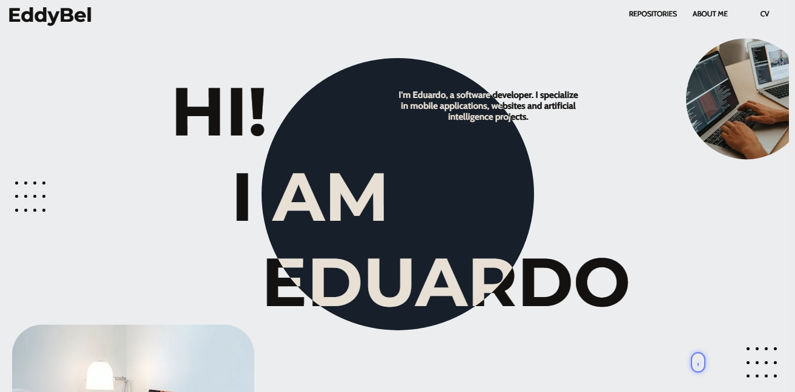

<h1 align="center">Portafolio Web</h1>


---

## Description

This web portfolio is a dynamic application built with TypeScript as the main language and Sass for styling. It uses Vite.js as the development environment and is deployed on a web server for public access. The application integrates with the GitHub API to collect information about my repositories and profile data in real time. In addition, it also integrates with a personal API that provides access to additional information about my projects, biography and blog posts. The application includes an email feature that allows users to send messages directly to my email. The application architecture is designed to be scalable and efficient in terms of speed and performance.

## Why ?

The main purpose of building this web portfolio is to showcase my skills and experience in web development to the world. I wanted to have an online space where potential clients, employers and collaborators can learn about my previous projects and professional background. By integrating the GitHub API, I can showcase my repositories and profile data in real time, which adds an element of transparency and authenticity to my portfolio. In addition, the integration with a personal API allows me to share additional information about my projects, biography and blog posts, providing a more complete view of who I am as a web developer. The email feature also allows for more direct communication with those interested in my work.

## Preview



## Requirements

To be able to run the app it is necessary to have some previous programs.

- [NodeJS](https://nodejs.org/en/)

## Project execution

The first thing to do is to clone the repository on your local device, this can be done in the following way.

```bash
git clone https://github.com/EddyBel/Portafolio-Web.git
```

Then we must enter the project.

```bash
cd Portafolio-Web
```

Then the corresponding dependencies must be installed in the package.jso, these can be installed with npm or yarn.

```bash
npm install
```

```bash
yarn install
```

Once the packages are installed, you can run the app with the command "run".

```bash
npm run dev
```

## Environment variables

This project requires some environment variables to work properly. The variables and their purpose are described below:

- **VITE_GITHUB_USER_NAME**: This variable indicates the username that will be used to access the GitHub API and get information about my repositories and profile.

- **VITE_YO_API**: This variable indicates the address of the personal API that is used to get additional information about my projects, biography and blog posts.

- **VITE_USERNAME_YO_API**:This variable indicates the user name required to access the personal API.

- **VITE_PASSWORD_YO_API**: This variable indicates the password required to access the personal API.

It is important to establish these environmental variables before executing this project to ensure an optimal experience.

## Project status

The current status of this project is version 1.0. Although it is considered a stable version, the project is still adding features and design improvements. Users can expect more updates in the future as work continues to improve the functionality and look and feel of this web portfolio.

## LICENCE

This project is released under the terms of the MIT license. The MIT license allows users to use, copy, modify and distribute the source code of the project with certain restrictions and requirements. For more information on the terms and conditions of the MIT license, please refer to the license file included with this project or visit https://opensource.org/licenses/MIT.

## Technologies used

This web portfolio was built using the following technologies.

- TypeScript: Used as the main programming language for application development.
- Sass: Used to style the application and improve the user experience.
- Vite.js: It is used as the development environment for the application and provides a fast and efficient development experience.
- GitHub API: Integrates with the GitHub API to get information about my repositories and profile data in real time.
- [Personal API](https://github.com/EddyBel/My-personal-api): Integrates with a personal API to get additional information about my projects, biography and blog posts.
